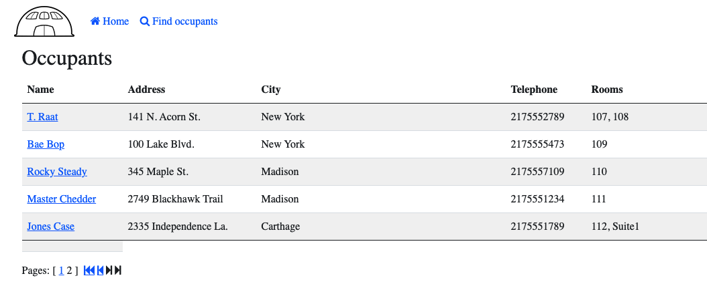

# Hardtop Hotels InnKeeper Application 

## Details about the InnKeeper Application
This application is a part of a larger set of Hardtop hotel applications used to demonstrate Modern Applications on VMware Cloud on AWS. This app specifically was built do demonstrate App Transformer.

## Running innkeeper locally
Innkeper is a [Spring Boot](https://spring.io/guides/gs/spring-boot) application built using [Maven](https://spring.io/guides/gs/maven/). You can build a jar file and run it from the command line (it should work just as well with Java 8, 11 or 17):


```
git clone https://github.com/eshanks16/hardtophotels-innkeeper.git
cd innkeeper
./mvnw package
java -jar target/*.jar
```

You can then access innkeeper app here: http://localhost:8080/



Or you can run it from Maven directly using the Spring Boot Maven plugin. If you do this it will pick up changes that you make in the project immediately (changes to Java source files require a compile as well - most people use an IDE for this):

```
./mvnw spring-boot:run
```

## Building a Container

There is no `Dockerfile` in this project. You can build a container image (if you have a docker daemon) using the Spring Boot build plugin:

``` bash
./mvnw spring-boot:build-image
```

## Database configuration

In its default configuration, Innkeeper uses an in-memory database (H2) which
gets populated at startup with data. The h2 console is automatically exposed at `http://localhost:8080/h2-console`
and it is possible to inspect the content of the database using the `jdbc:h2:mem:testdb` url.

A similar setup is provided for MySQL and PostgreSQL in case a persistent database configuration is needed. Note that whenever the database type is changed, the app needs to be run with a different profile: `spring.profiles.active=mysql` for MySQL or `spring.profiles.active=postgres` for PostgreSQL.

> Note: To configure mysql connection strings look in the `application-mysql.properties` file.

To use mysql with this application configure the build with:

``` bash
./mvnw spring-boot:run -Dspring-boot.run.profiles=mysql
```